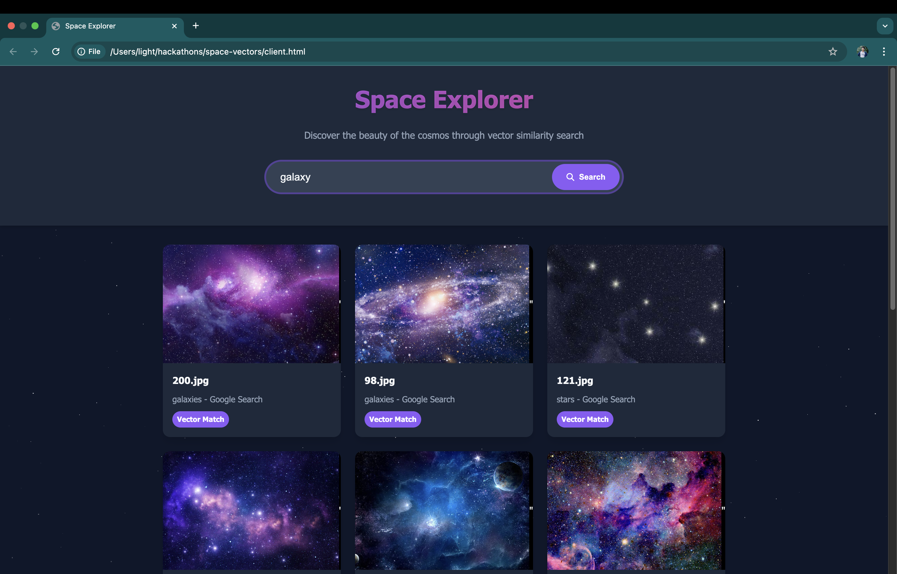

# Space Vectors

Vibe coding at Github office because I need to do something for 2 slices of pizza and 1 coke. Everything takes a little bit over 1 hour. Thanks Claude.ai

### Dataset
https://www.kaggle.com/datasets/abhikalpsrivastava15/space-images-category

### Data Ingestion
Need to create a weaviate database on cloud and create a collection
```
python ingestion.py path/to/root/folder/ --collection collection_name
```

Script will walk all subdirectories, ingest images, vectorize and store in the database.

### API
```
python api.py
```

Single file flask api endpoint to retrieve relevant image vectors

### Client
Just open `client.html` with browser.
The image location is hardcoded to point to my local machine. Point to image root folder.


